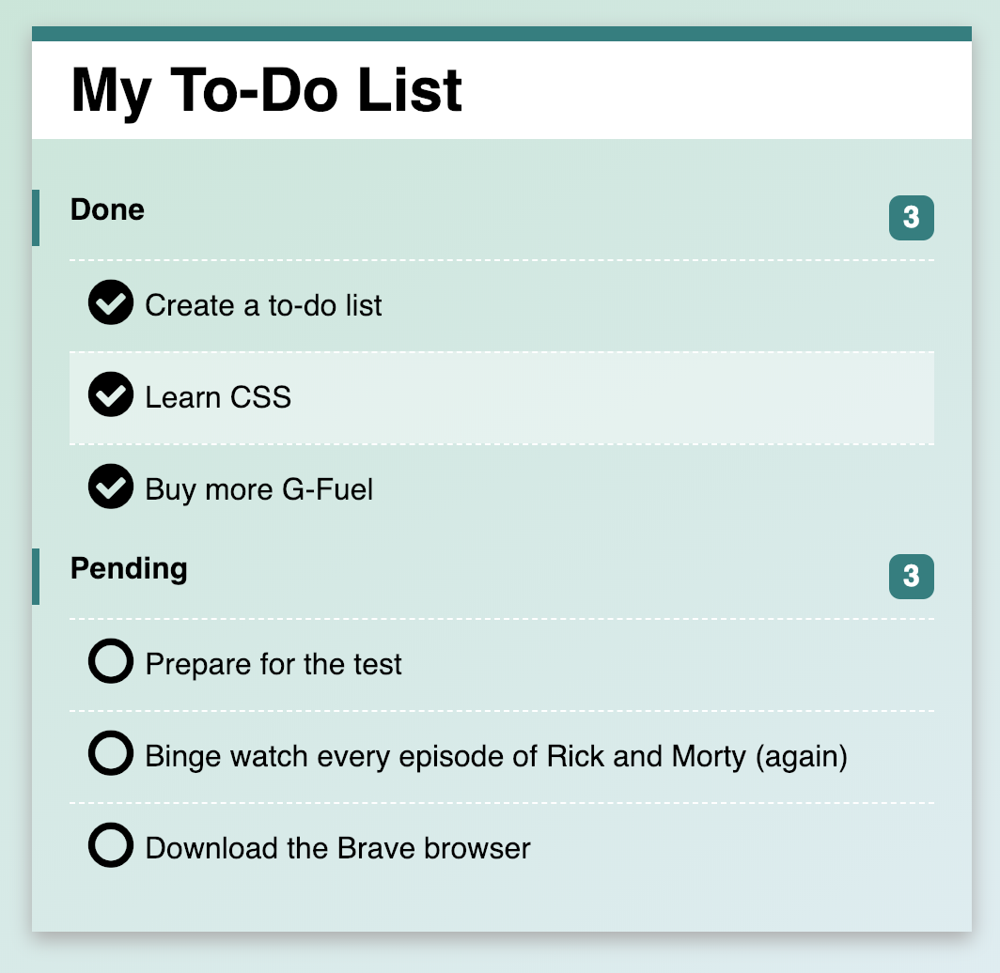

# salt-jsfs-cssToDoList
## To-Do-Lists, huh?
Todays task is making an interactive To-Do-List, using only CSS. A wise man (Jakob) once said: 

```If you need to learn a new language, make a to-do-list.```

We have provided you with the html file and you are supposed to, using only css - be able to:

* Mark things as done
* Have those things automatically moved to a 'done' column

_You are NOT allowed to:_
* Touch the html file
* Use any form of JavaScript


